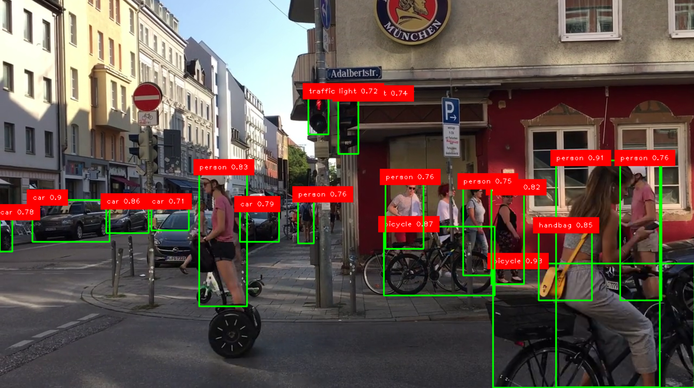

# YOLO-Basics 🚀

This project is the first step toward real-world applications using YOLO (You Only Look Once).
It is designed for beginners who want to understand how object detection works using YOLO with minimal setup.

The repository contains:

* A Python script for object detection on video/webcam
* An output video demonstrating the detection results
* A sample output image

## 🎥 Output Demo

[▶ Watch Output Video](output.mp4)

## 🖼️ Sample Output

## 📌 Features

* Real-time object detection using webcam or video
* Detection results saved as an output video
* Easy-to-understand and beginner-friendly code
* Uses YOLO for fast and accurate detection

---
